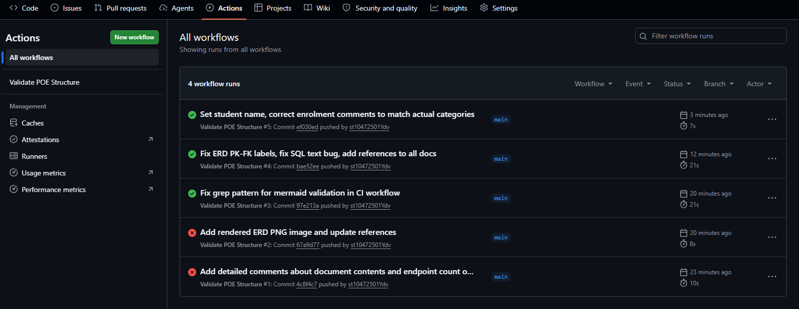

# RaceDay

RaceDay is a web-based event management system for South African road running, walking, and cycling events. The platform lets Organisers create and manage events, while Participants can browse, enter events, and track their results.

## System Description

South Africa has a big road events culture, from the Comrades Marathon to the Cape Town Cycle Tour and hundreds of community runs every weekend. Most of these events are still run with paper registration and spreadsheets. RaceDay aims to fix that by giving organisers and participants one place to manage everything.

The system supports two user roles:

### Organiser
- Create, edit, and delete events
- Set up event categories (like 5km, 10km, 21km, 42km)
- Capture and manage participant results
- View all event enrolments

### Participant
- Create an account and log in
- Browse upcoming events
- Enter an event by selecting a category
- View their own enrolments
- Track their personal results and finish times

## Project Structure

```
RaceDay-POE/
├── docs/
│   ├── ERD.md                    # Entity Relationship Diagram with Mermaid code
│   ├── API-Endpoint-Plan.md      # Full API endpoint specification
│   ├── API-Endpoint-Plan.docx    # Word version of the API plan
│   └── RaceDay-Database.sql      # SQL Server script to create and seed the database
├── .github/
│   └── workflows/
│       └── validate-docs.yml     # CI/CD workflow that validates repo structure
├── generate-docx.js              # Script to generate the Word document
├── package.json                  # Node.js dependencies for docx generation
└── README.md
```

## Database

The database has 6 tables:

1. **Users** - All user accounts (Organisers and Participants)
2. **OrganiserDetails** - Extra info for Organiser users
3. **Events** - All races and events
4. **Categories** - Distance categories for each event
5. **Enrolments** - When participants sign up for a category
6. **Results** - Finish times and positions after events

To set up the database:
1. Open SQL Server Management Studio (SSMS)
2. Open the file `docs/RaceDay-Database.sql`
3. Run the script - it creates all tables and adds sample data

## CI/CD

The GitHub Actions workflow (`.github/workflows/validate-docs.yml`) runs on every push and checks that:
- The `/docs` folder exists
- The ERD file is present
- The API Endpoint Plan is present
- The SQL script is present
- The README exists
- The SQL script has CREATE TABLE and INSERT statements
- The ERD has Mermaid code

### CI Build Status

<!-- Replace the line below with a screenshot of a successful green build -->


## Video Presentation

<!-- Replace this link with your unlisted YouTube video link -->
[Watch the Part 1 walkthrough video on YouTube](https://youtu.be/YOUR_VIDEO_ID_HERE)

The video covers:
- Walkthrough of the ERD and why I chose these entities
- Explanation of the API endpoint plan
- Running the SQL script live in SSMS
- How the system is designed for both user roles

## AI Disclosure

AI tools were used to assist with planning and drafting documentation in this project.

---

**Student:** [Your Name]
**Student Number:** st10472501
**Module:** INSY
**Date:** September 2026
