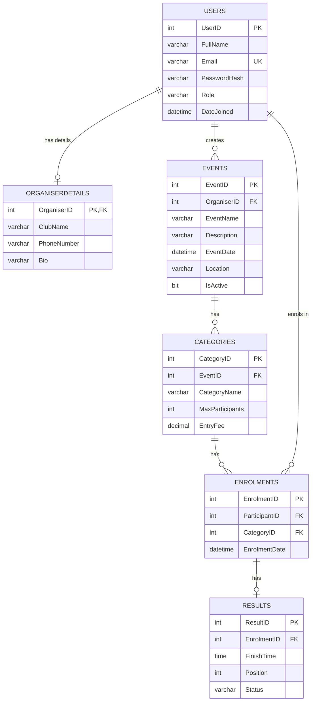

# RaceDay - Entity Relationship Diagram

## System Overview

RaceDay is a platform for managing road running, walking, and cycling events in South Africa. The system has two types of users: Organisers who set up and manage events, and Participants who sign up and take part in them.

## Entities

### 1. Users
The main table that stores all user accounts. Every person who uses the system has a record here, whether they are an organiser or a participant.

| Column | Type | Notes |
|--------|------|-------|
| UserID | INT | Primary Key, auto-increment |
| FullName | NVARCHAR(100) | Not null |
| Email | NVARCHAR(150) | Unique, not null |
| PasswordHash | NVARCHAR(255) | Not null |
| Role | NVARCHAR(20) | Either 'Organiser' or 'Participant' |
| DateJoined | DATETIME | Default = GETDATE() |

### 2. OrganiserDetails
Extra information for users who are organisers. Not every user needs this, only those with the Organiser role.

| Column | Type | Notes |
|--------|------|-------|
| OrganiserID | INT | Primary Key, Foreign Key to Users |
| ClubName | NVARCHAR(100) | Can be null |
| PhoneNumber | NVARCHAR(20) | Can be null |
| Bio | NVARCHAR(500) | Can be null |

### 3. Events
All the races and events that organisers create.

| Column | Type | Notes |
|--------|------|-------|
| EventID | INT | Primary Key, auto-increment |
| OrganiserID | INT | Foreign Key to Users |
| EventName | NVARCHAR(200) | Not null |
| Description | NVARCHAR(1000) | Can be null |
| EventDate | DATETIME | Not null |
| Location | NVARCHAR(200) | Not null |
| IsActive | BIT | Default = 1 |

### 4. Categories
Each event can have different categories (like 5km, 10km, 21km). This lets participants choose which distance they want to enter.

| Column | Type | Notes |
|--------|------|-------|
| CategoryID | INT | Primary Key, auto-increment |
| EventID | INT | Foreign Key to Events |
| CategoryName | NVARCHAR(100) | Not null (e.g. "5km Fun Run") |
| MaxParticipants | INT | Can be null, 0 means unlimited |
| EntryFee | DECIMAL(10,2) | Default = 0.00 |

### 5. Enrolments
When a participant signs up for a category, that is an enrolment. This links the user to the specific category they entered.

| Column | Type | Notes |
|--------|------|-------|
| EnrolmentID | INT | Primary Key, auto-increment |
| ParticipantID | INT | Foreign Key to Users |
| CategoryID | INT | Foreign Key to Categories |
| EnrolmentDate | DATETIME | Default = GETDATE() |

### 6. Results
After the event takes place, organisers capture the results. Each enrolment can have one result with the finish time and position.

| Column | Type | Notes |
|--------|------|-------|
| ResultID | INT | Primary Key, auto-increment |
| EnrolmentID | INT | Foreign Key to Enrolments, Unique |
| FinishTime | TIME(7) | Not null |
| Position | INT | Can be null |
| Status | NVARCHAR(20) | Finished, DNF, Disqualified |

## Relationships

- **Users to OrganiserDetails**: One-to-One. An organiser user has one record in OrganiserDetails. If the user is a Participant, they have no record in this table.
- **Users to Events**: One-to-Many. One organiser can create many events. Each event belongs to exactly one organiser.
- **Events to Categories**: One-to-Many. One event has many categories (like 5km, 10km, 21km). Each category belongs to exactly one event.
- **Categories to Enrolments**: One-to-Many. One category can have many participants enrolled. Each enrolment is for exactly one category.
- **Users to Enrolments**: One-to-Many. One participant can enrol in many categories across different events. Each enrolment belongs to exactly one participant.
- **Enrolments to Results**: One-to-One. Each enrolment gets one result after the event. Not every enrolment will have a result yet if the event has not happened.

## Mermaid ERD Code

Copy the code below into a Mermaid renderer (like mermaid.live) to see the diagram.

## Design Notes

I went with 6 entities because that is the minimum the rubric asks for. The OrganiserDetails table could have been merged into Users, but I split it out so that only organisers have that extra info. The Results table is separate from Enrolments because not every enrolment will have a result yet (the event might not have happened).

The Role field in Users is a simple string. I thought about making a separate Roles table, but for this project a string is fine since there are only two roles.

The UQ_ParticipantCategory unique constraint on Enrolments stops a participant from enrolling in the same category twice. This makes sense because you would not want to pay for the same race twice.

I used ON DELETE CASCADE on some foreign keys (like OrganiserDetails and Categories) so that when you delete a parent record, the child records go with it. But I did not use cascade on Events because if you delete an organiser, you probably still want to keep the events they created.

## How to Render the ERD

1. Go to [mermaid.live](https://mermaid.live)
2. Copy the Mermaid code from above
3. Paste it into the editor
4. The diagram will render automatically
5. You can export it as a PNG or SVG image

---

*Note: AI tools were used to help with planning and drafting this document.*
